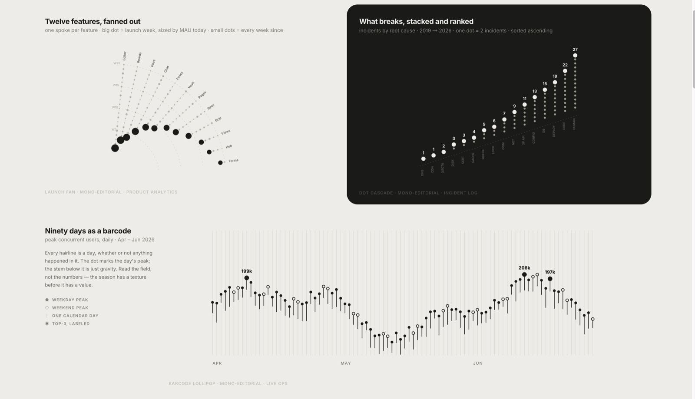
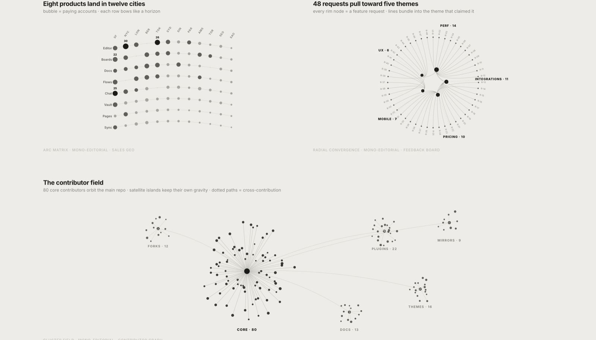
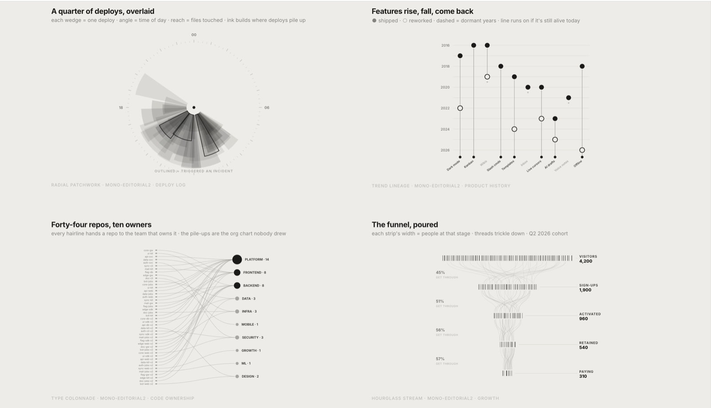
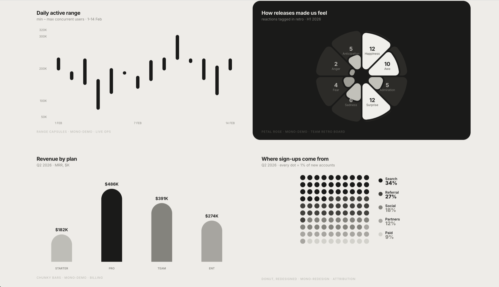
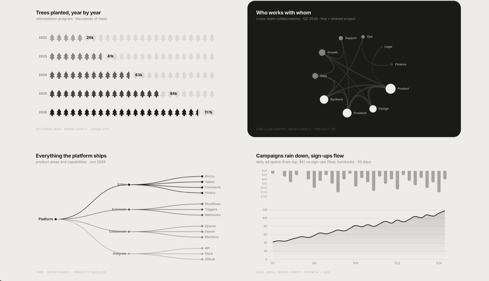
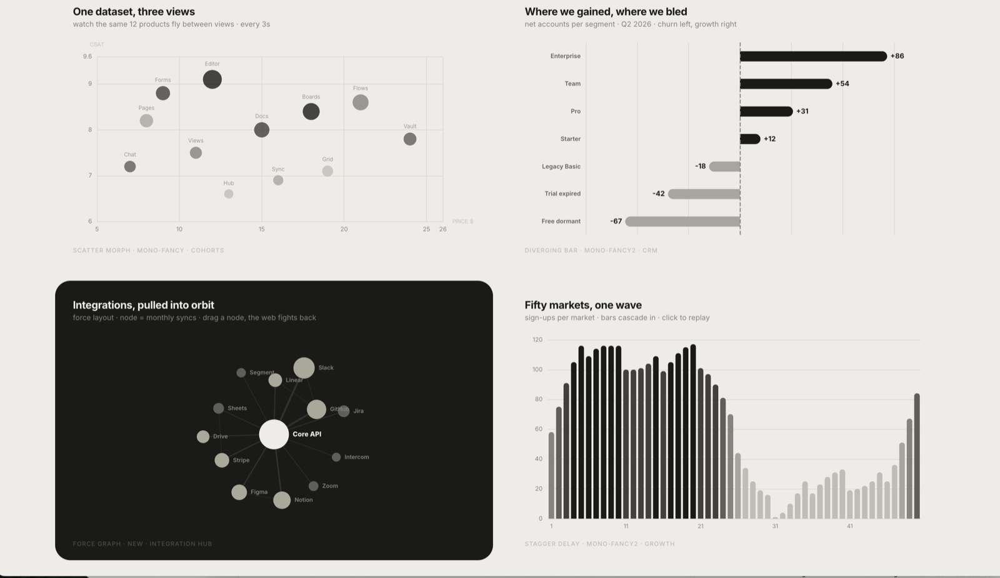
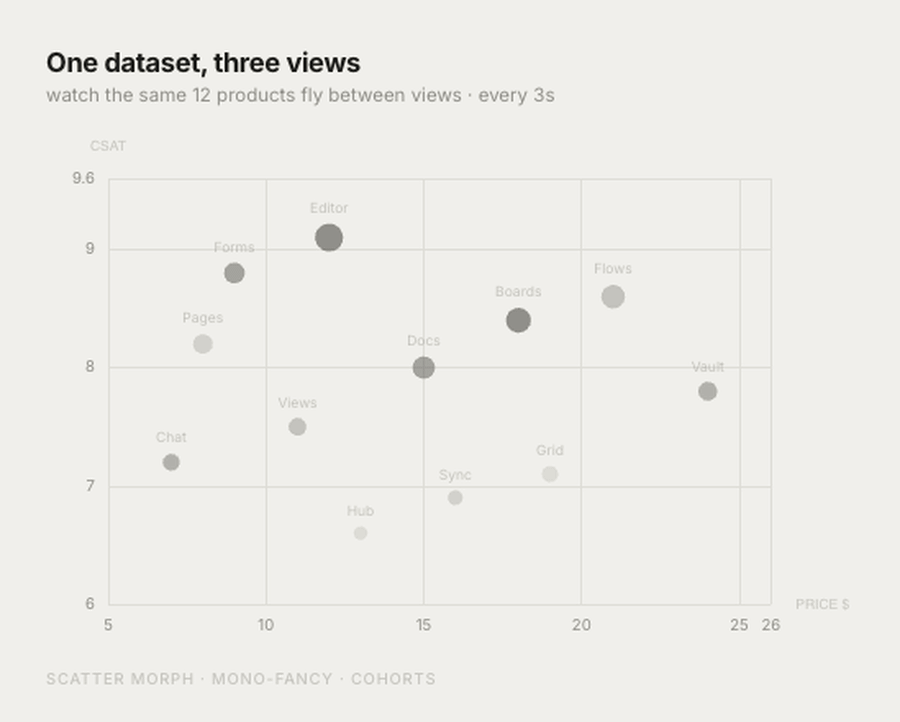
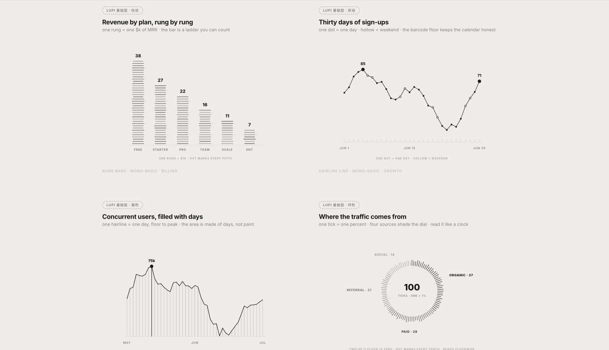
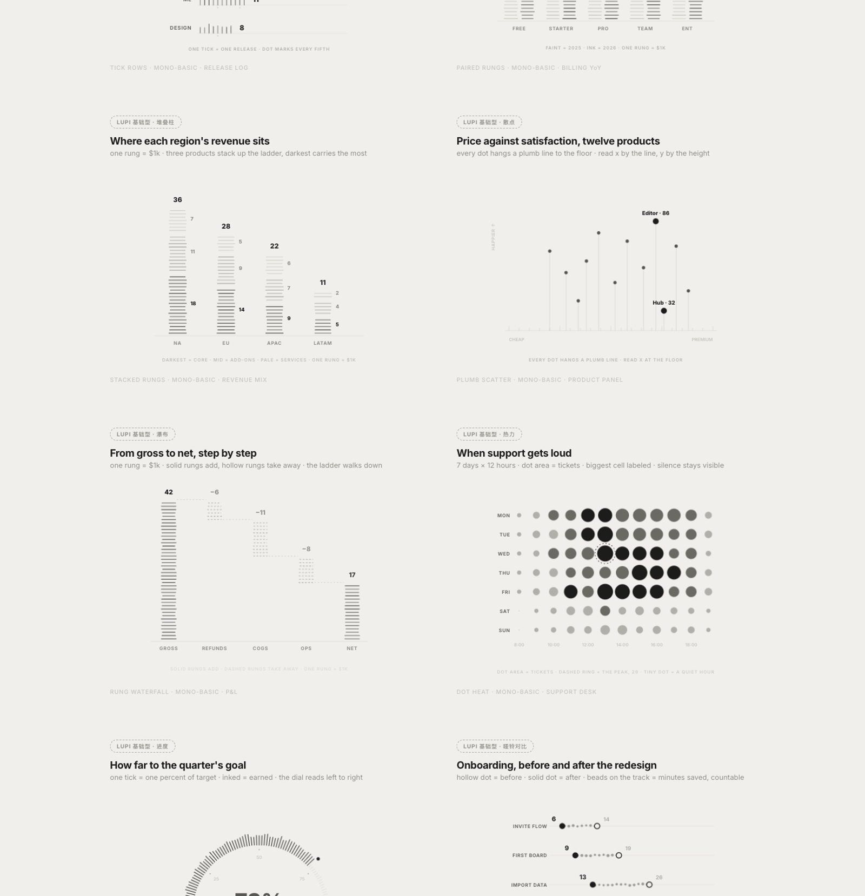
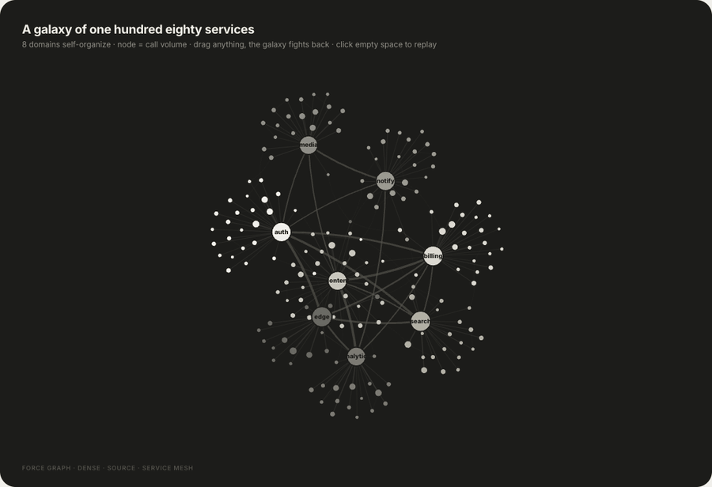

# Lieflat Charts

> 让数据图表更像一页经过设计的内容，而不是一张被导出的图。

Lieflat Charts 是一套遵循 Agent Skills 格式的单色数据可视化 skill，可供 moxt、Claude Code、Codex 及其他兼容 `SKILL.md` 的 AI agent 使用。本 skill 由 moxt 与 Codex 协同制作，专注于把数据图表做成有编辑感、能阅读、能组成完整页面的视觉内容。

它用统一的单色灰阶、字体、留白、线条和动效建立自己的视觉语法，包括以下几种视觉风格：

- **Lupi（编辑叙事型）**：用细线、点阵、逐条记录和大量留白展开数据，强调真实单位、细节和旁注，适合论文、长文、年报与需要慢慢阅读的数据故事。
- **Glance（快速判断型）**：用粗柱、大数字、色块和清晰排序提前聚合信息，让读者几秒内看懂高低、变化和异常，适合周报、汇报与 dashboard。
- **Basics（基础编辑型）**：保留柱状图、折线图、环形图等熟悉轮廓，再用可数刻度、发丝线和编辑排版增加质感，适合结构简单或数据量较少的内容。

此外还提供网络、路径和多段流向等独立交互大图。每张图都尽量保留数据的真实单位，同时让标题、旁注、来源和页面结构参与表达。

## Preview

以下是几类模板的实际预览。

### Lupi Editorial

细读、逐记录、编辑感。精选 15 张编辑叙事型模板中的代表图型。

<table>
  <tr><td></td></tr>
  <tr><td></td></tr>
  <tr><td></td></tr>
</table>

### Glance

快读、聚合、结论先行。精选 18 张快速判断型模板中的代表图型。

<table>
  <tr><td></td></tr>
  <tr><td></td></tr>
  <tr><td></td></tr>
</table>

动态预览：



### Lupi Basics

常见图型与可数单位的结合。精选 12 张基础编辑型模板中的代表图型。

<table>
  <tr><td></td></tr>
  <tr><td></td></tr>
</table>

### Interactive

用于网络、路径与高密度关系数据。

动态预览：



[打开 Force Graph 模板体验拖拽与缩放](https://larashero3-dotcom.github.io/lieflat-charts/templates/big-force.html)

## 零门槛快速使用

一条命令安装：

```bash
npx skills add https://github.com/larashero3-dotcom/lieflat-charts --skill lieflat-charts
```

也可以直接把这段话发给有 shell 权限的 AI Agent：

```text
帮我安装 lieflat-charts。请把 https://github.com/larashero3-dotcom/lieflat-charts
克隆到 ~/.claude/skills/lieflat-charts，安装完成后检查 SKILL.md、templates/、
catalog.md 和 mono-tokens.js 是否存在。
```

使用 Codex 时，将安装路径换成 `~/.codex/skills/lieflat-charts`。

已经安装过的话，用这段话更新：

```text
帮我更新 lieflat-charts。请进入 ~/.claude/skills/lieflat-charts 执行 git pull，
然后告诉我当前最新 commit。
```

安装后直接对 Agent 说：

```text
把这份调研数据做成适合公众号长文的 5 张中文版图表。
先比较 Lupi、Glance 和基础型候选，再决定每张图属于哪个体系。
```

也可以试这些请求：

```text
读这篇论文，找出最值得讲的几个数据结论，做成一页完整的 HTML 图表。
```

```text
这是一份周报数据，要求 10 秒内看懂排名、变化和异常。
```

```text
把这个 CSV 做成一张适合放进汇报里的 Glance 图表。
```

```text
用 Lupi 风格重新设计这组数据，保留每条真实记录，并加入必要的旁注。
```

图数由独立结论决定：单个问题通常 1 张，两个到三个结论 2–3 张，完整文章或论文 4–6 张，单页默认最多 6 张。用户明确指定数量时会遵守，但不会为了凑数重复表达同一个结论。

## Templates

| 类型 | 数量 | 适合什么 | 实现 |
|---|---:|---|---|
| **Lupi Editorial** | 15 | 年报、论文、公众号、海报、作品集；读者愿意停下来细看 | 手写 SVG |
| **Lupi Basics** | 12 | 柱、折线、面积、环形、散点、瀑布、热力、进度等基础数据形状 | 手写 SVG |
| **Glance** | 18 | 周报、dashboard、监控、汇报；需要快速排序和比较 | Chart.js / ECharts |
| **Interactive** | 3 | 网络、路径、多段流向和高密度关系数据 | ECharts / SVG |

### Lupi Editorial

把一个点、一根线或一条旁注尽量对应到真实数据单位。它不急着把数据聚合成一个结论，而是把原材料摊开，让读者看到结构、分布和例外。视觉上使用发丝线、留白、账本式导轨、旁注和低对比灰阶，阅读时间通常在 30 秒以上。

### Lupi Basics

保留常见图表的剪影，但把它们放进 Lupi 的编辑语法里：一格可以是一个百分点，一根 tick 可以是一个人，一条 hairline 可以是一天。它适合数据不多、但仍然希望画面有密度和可读单位的场景。

### Glance

提前聚合、加粗主要形状，把关键排序和变化放到第一眼。它不是“低配版 Lupi”，而是另一种阅读速度：读者不需要展开每条记录，也能在几秒内知道谁更高、哪里变化最大、哪个指标需要关注。

### Interactive

用于普通静态图承载不了的关系数据。通过 hover、聚焦、拖拽、固定路径和状态栏，把“看起来很复杂”的网络变成可以逐条查询的图。交互只服务于真实记录，不给纯装饰元素添加假的行为。

## Design

所有体系共享一套 Mono 视觉语法：纸灰与炭黑两极，加上中间灰阶；明度承担层级，位置、长度、密度和结构承担数据编码。创新不在于再发明一种孤立图型，而在于把图型选择、编辑排版、浏览器交互和整页叙事放进同一个可复用的 skill。

因此，Lieflat Charts 和过去直接做 charts 的差别，不只是“换了颜色”：

- 先判断数据契约，再选图型，而不是先挑一个库内模板
- 每张图先承担一个独立结论，再组成整页，而不是把所有字段都画上去
- 把真实数据单位作为视觉原子，不用装饰性噪声伪造密度
- 把标题、旁注、来源、留白和动效视为图表的一部分
- 用 Lupi 和 Glance 表达两种阅读速度，而不是把静态图和交互图当成唯一分类

## Structure

```text
.
├── SKILL.md                 # Agent 使用的工作流与规则
├── catalog.md               # 48 个图型的数据契约索引
├── mono-tokens.js           # 共享视觉 token
├── templates/               # Lupi、Basics、Glance 与交互大图
├── examples/                # 真实公开数据案例
├── docs/assets/             # README 模板截图与动态预览
└── scripts/validate.mjs     # 发布前检查
```

直接打开 `templates/` 下的 HTML 文件即可查看 gallery。Lupi 和 Basics 主要使用原生 SVG；Glance、Circular 和 Force 模板通过 CDN 加载 Chart.js 或 ECharts，需要联网才能完整显示。

## License

本项目使用 [PolyForm Noncommercial License 1.0.0](LICENSE)。允许学习、修改、分享和非商业使用；商业使用需要另行取得许可。

Chart.js、Apache ECharts 和 Inter 字体遵循各自的原始许可证，详见 [THIRD_PARTY_NOTICES.md](THIRD_PARTY_NOTICES.md)。
